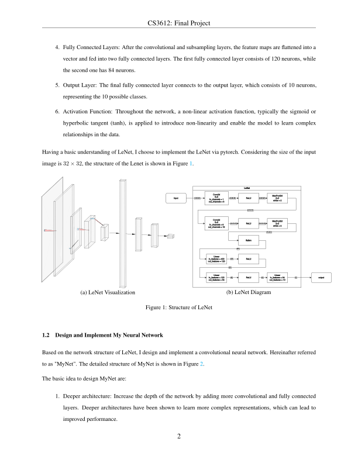
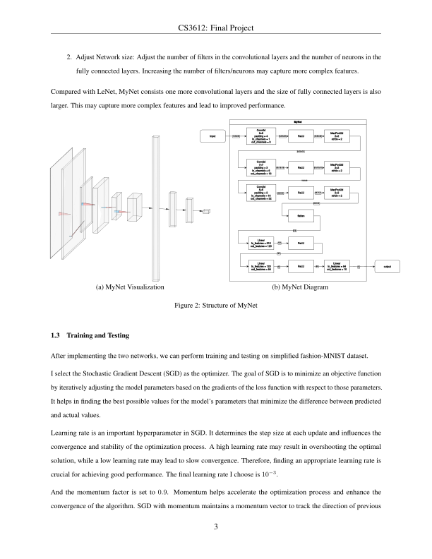
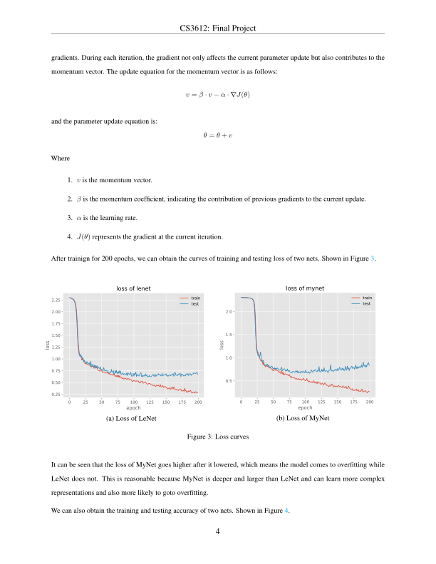
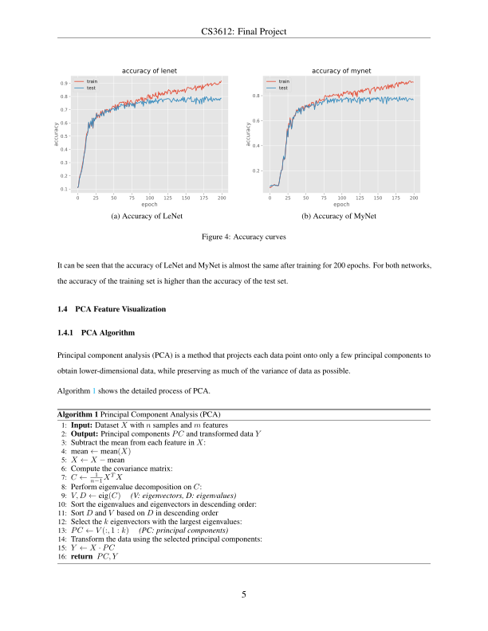
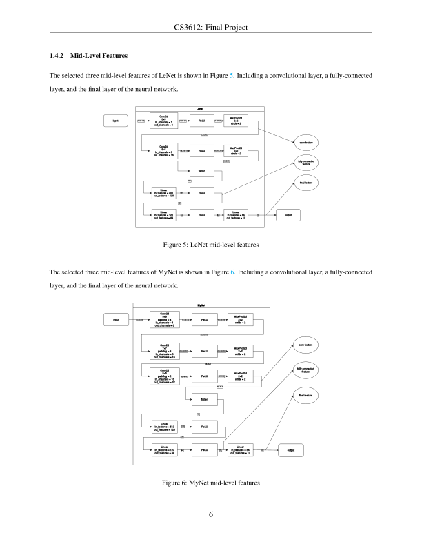
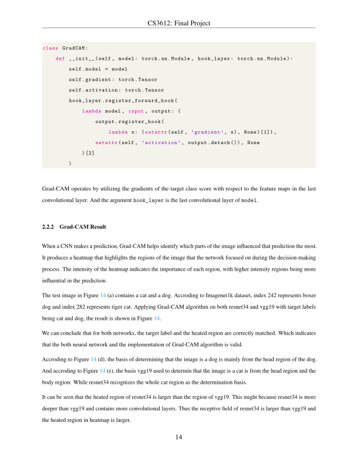
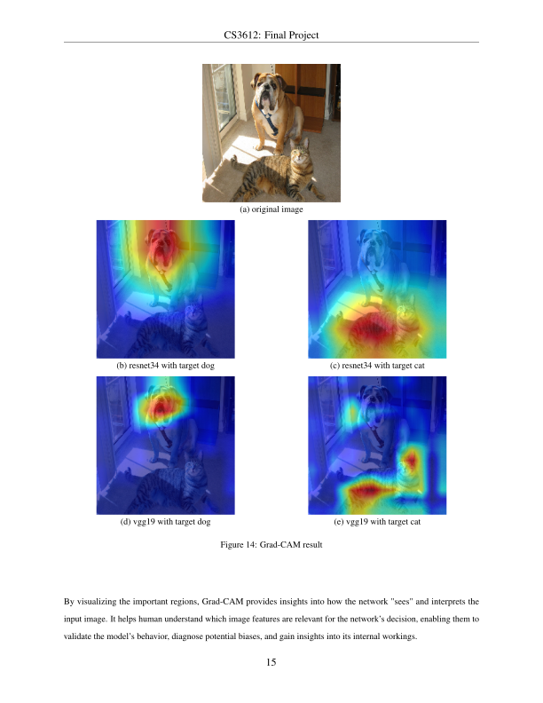
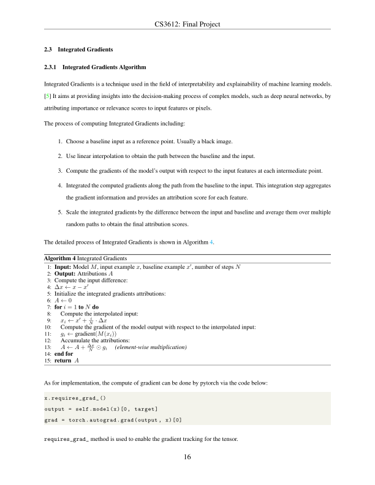
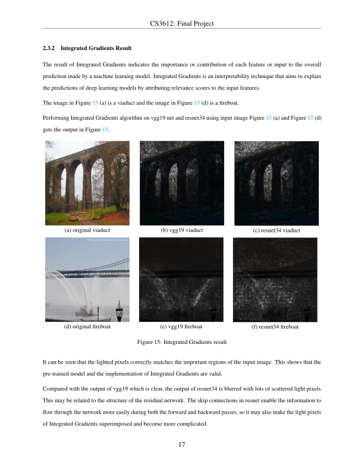
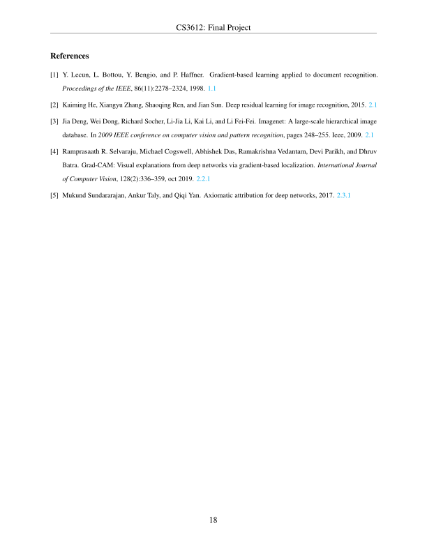

# CS3612-Project

## Requirements
```text
python -m pip install -r requirements.txt
```

## Mandatory Task

```text
cd './mandatory task/'
```

command to train and test nets
```text
python main.py
```

command to visualize mid-level features
```text
python visualize.py
```


## Optional Task

```text
cd './optional task2/'
```

command to get Grad-CAM result
```text
python grad_cam.py
```

command to get Integrated Gradients result
```text
python integrated_gradients.py
```

## Report

 
 
 
 
 
 
 
 
 






