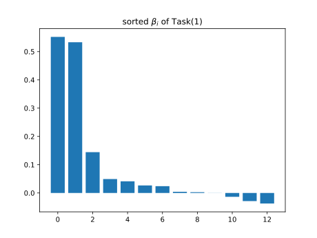
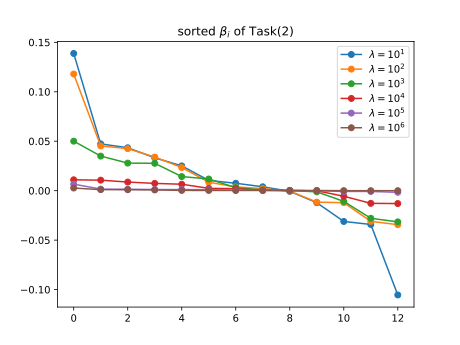
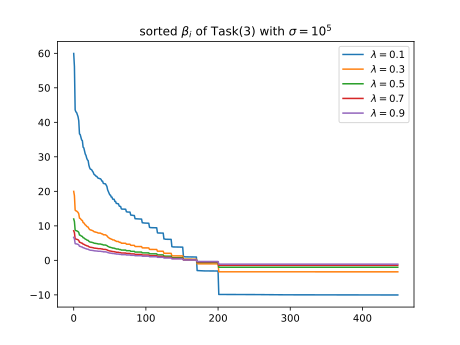
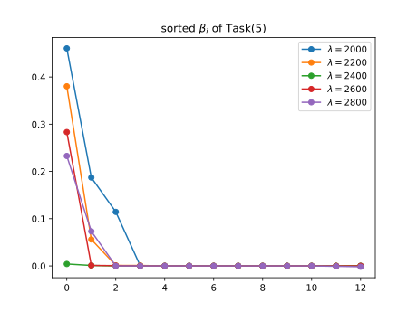

### Task(1) Find a linear model to solve the regression problem.
The MSE loss can be written as:
$$
L(\beta) = {\lVert Y - X\beta\rVert}_2^2
$$
The gradient can be written as:
$$\begin{aligned}
    \frac{\partial L(\beta)}{\partial \beta} &= \frac{\partial {\lVert Y - X\beta\rVert}_2^2}{\partial \beta}\\
    &= -2 X^\top\left(Y-X\beta\right)
\end{aligned}$$
Using gradient descent to calculate $\beta$:
$$
\beta_{t+1} = \beta_t - \eta\cdot\left(-2 X^\top\left(Y-X\beta\right)\right)
$$
Where $\eta$ is learning rate.
$$
Error_\text{test} = \sum_{i=1}^m \left(y_1 - f\left(X_i\right)\right)^2
$$
After $100000$ iterations with $\eta = 0.001$, the $Error_\text{test}$ defined as above is $190.52631008965514$.
The stdout is:
```text
Task(1):
beta = [ 5.33052946e-01  4.12641248e-02  4.92870780e-02  1.44349983e-01
  2.40886173e-02  2.75480488e-03  4.20735754e-03 -3.03859472e-04       
 -2.86934505e-02 -3.71851433e-02 -1.35701831e-02  2.66545668e-02       
  5.51986584e-01]
loss = 190.52631008965514
```
And the visualization of the weight vector $\beta$ is: 

### Task(2) Using Ridge Regression to solve the regression problem.
The loss can be written as:
$$
L(\beta) = {\lVert Y - X\beta\rVert}_2^2 + \lambda \lVert \beta \rVert_2^2
$$
The gradient can be written as:
$$\begin{aligned}
    \frac{\partial L(\beta)}{\partial \beta} &= \frac{\partial {\lVert Y - X\beta\rVert}_2^2 + \lambda \lVert \beta \rVert_2^2}{\partial \beta}\\
    &= -2 X^\top\left(Y-X\beta\right) + 2\lambda \beta
\end{aligned}$$
Let
$$
\frac{\partial L(\beta)}{\partial \beta} = 0\\
$$
We have
$$
\beta = \left(X^\top X + \lambda I\right)^{-1}X^\top Y
$$
Try out different $\lambda$ and find the minimul loss. The stdout is
```text
Task(2):
lambda = 10                   loss = 193.1719239298978
lambda = 100                  loss = 190.64552450846662
lambda = 1000                 loss = 186.57235083360067
lambda = 10000                loss = 173.33544686440175
lambda = 100000               loss = 168.967456043671
lambda = 1000000              loss = 178.7360808699323

best_beta = [ 8.21943627e-05  1.54299477e-03  1.00523867e-03  1.16273744e-03
  3.83008956e-04  6.61266799e-03  1.45027551e-03  4.79238031e-04
 -1.62703231e-03 -8.11543685e-04 -7.97680714e-04  1.13904484e-03
 -1.46033335e-05]
best_loss = 168.967456043671
```
When $\lambda = 10^5$, the loss is minimul.
And the visualization of the weight vector $\beta$ is:

### Task(3) Using RBF kernel regression to solve the regression problem.
The loss can be written as:
$$
L(c) = \lVert Y-Kc\rVert^2 + \lambda c^\top Kc
$$
where
$$K(x_i, x_j) = \phi(x_i)^\top \phi(x_j)$$

$$\begin{aligned}
    K &= \begin{bmatrix}
            \phi(x_1)^\top\phi(x_1) & \cdots & \phi(x_1)^\top\phi(x_n)\\
            \vdots & \ddots & \vdots\\
            \phi(x_m)^\top\phi(x_1) & \cdots & \phi(x_m)^\top\phi(x_n)
        \end{bmatrix} \\
    &=  \begin{bmatrix}
            \phi(x_1)^\top\\
            \vdots\\
            \phi(x_n)^\top
        \end{bmatrix}
        \begin{bmatrix}
            \phi(x_1) & \cdots & \phi(x_n)
        \end{bmatrix}
\end{aligned}$$
Let
$$
\frac{\partial L(c)}{\partial c} = 0
$$
We have
$$
c = \left(K +\lambda I\right)^{-1}Y
$$
Case we have
$$\begin{aligned}
    Y_\text{train}^\text{pred} &= Kc\\
    &= \begin{bmatrix}
    \phi(x_1)^\top\\
    \vdots\\
    \phi(x_n)^\top
\end{bmatrix} \begin{bmatrix}
    \phi(x_1) &
    \cdots &
    \phi(x_n)
\end{bmatrix} \begin{bmatrix}
    c_1\\
    \vdots\\
    c_n
\end{bmatrix}\\
    &= \begin{bmatrix}
    \phi(x_1)^\top\\
    \vdots\\
    \phi(x_n)^\top
\end{bmatrix}\sum_{i=1}^n c_i \phi(x_i)
\end{aligned}$$
in the training, we have
$$\begin{aligned}
    Y_\text{test}^\text{pred} &= \begin{bmatrix}
    \phi(x_1)^\top\\
    \vdots\\
    \phi(x_m)^\top
\end{bmatrix}\sum_{i=1}^n c_i \phi(x_i)\\
    &= \begin{bmatrix}
    \phi(x_1)^\top\\
    \vdots\\
    \phi(x_m)^\top
\end{bmatrix} \begin{bmatrix}
    \phi(x_1) &
    \cdots &
    \phi(x_n)
\end{bmatrix} \begin{bmatrix}
    c_1\\
    \vdots\\
    c_n
\end{bmatrix}\\
    &=\begin{bmatrix}
        \phi(x_1)^\top\phi(x_1) & \cdots & \phi(x_1)^\top\phi(x_n)\\
        \vdots & \ddots & \vdots\\
        \phi(x_m)^\top\phi(x_1) & \cdots & \phi(x_m)^\top\phi(x_n)
    \end{bmatrix} \begin{bmatrix}
    c_1\\
    \vdots\\
    c_n
\end{bmatrix}
\end{aligned}$$
in testing.
Set $\sigma = 10^5$ and try out different $\lambda$ to find the minimul loss. The stdout is
```text
Task(3):
lambda = 0.1                  loss = 155.29346939385917  
lambda = 0.3                  loss = 155.1889666982272   
lambda = 0.5                  loss = 155.1868258245468   
lambda = 0.7                  loss = 155.19959272106766  
lambda = 0.9                  loss = 155.21735678971228  

best_c = [...]
best_loss = 155.1868258245468
```
Case $c$ is too long, I won't put it in this report. $c$ can be obtained via executing the code.
We can see that the best $\lambda = 0.5$.
And the visualization of the weight vector $c$ is:

### Task(4) Using Spline Regression to solve the regression problem.
```text
Task(4):
task(4) 涉及高维的spline regression,  课堂上没有教。这一个task可以不用做。
```
### Task(5) Using Lasso Regression to solve the regression problem.
The loss can be written as:
$$
L(\beta) = \frac{1}{2}{\lVert Y-X \beta\rVert}_2^2 + \lambda {\lVert\beta\rVert}_1
$$
The gradient can be written as:
$$\begin{aligned}
    \frac{\partial L(\beta)}{\partial\beta} &= \frac{\partial \frac{1}{2}{\lVert Y-X \beta\rVert}_2^2 + \lambda {\lVert\beta \rVert}_1}{\partial\beta}\\
    &= \lambda\cdot\text{sign}(\beta) - X^\top \left(Y-X\beta\right)
\end{aligned}$$
Using gradient descent to calculate $\beta$:
$$
\beta_{t+1} = \beta_t - \eta\cdot\left(\lambda\cdot\text{sign}(\beta) - X^\top \left(Y-X\beta\right)\right)
$$
Where $\eta$ is learning rate.
Set the iteration num be $100000$ and $\eta = 10^{-4}$. Try out different $\lambda$ and the stdout is:
```text
Task(5):
lambda = 2000                 loss = 156.82043402173144  
lambda = 2200                 loss = 179.0831038785226   
lambda = 2400                 loss = 174.8449522295677   
lambda = 2600                 loss = 175.93794339250366  
lambda = 2800                 loss = 158.93595080304917  

best_beta = [ 4.60576688e-01  3.43504798e-06 -3.74674312e-06  6.88011475e-06
  1.14431192e-01 -1.60789531e-06 -3.12163388e-06  1.61820114e-04
  8.20035892e-06  6.95914888e-06 -4.12246454e-06 -3.27022231e-06
  1.87220832e-01]
best_loss = 156.82043402173144
```
We can see that the best $\lambda = 2000$.
And the visualization of the weight vector $\beta$ is:
