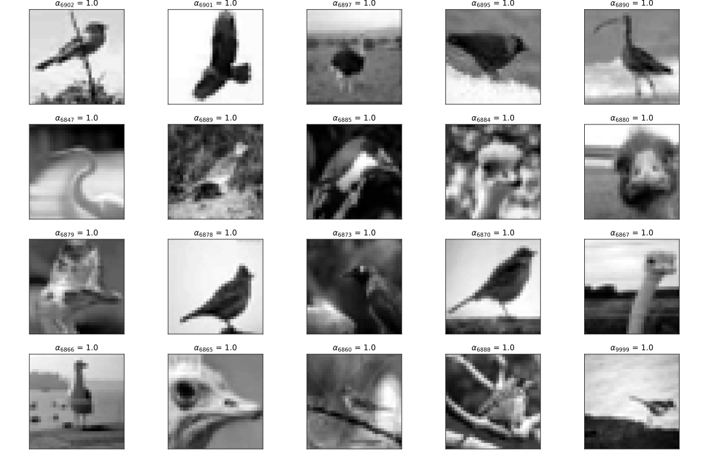

<center><h2>Homework 3</h2></center>
<div align=right>520030910246 薛家奇</div>

### 1. Linear SVM
Choose the linear model of class [`sklearn.svm.SVC`](https://scikit-learn.org/stable/modules/generated/sklearn.svm.SVC.html#sklearn.svm.SVC). The mathematical formulation can be written as:
$$
\min_{w,b,\xi} \frac{1}{2}\lVert w \rVert^2 + C\sum_{i=1}^n\xi_i\\
\begin{aligned}
   \text{s.t.} \qquad &y_i\left(w^\top x_i + b\right) \ge 1 - \xi_i\\
   &\xi_i \ge 0
\end{aligned}
$$
And the dual problem is:
$$
\min_\alpha \frac{1}{2}\alpha^\top Q \alpha - e^\top\alpha\\
\begin{aligned}
   \text{s.t.} \qquad &y^\top\alpha = 0\\
   &0 \le \alpha \le C
\end{aligned}
$$
where
$$
Q_{ij} = y_iy_jx_i^\top x_j
$$
Due to the lackness of hyper-parameters of linear svm model, I just use the default parameters.
With all hyper-parameters be default value (`C=1.0`), the accuracy on test dataset after training convergence is:
```text
Accuracy of Linear SVM: 0.846
```
Here are the tasks specifically for **Linear SVM**:
1. **How many support vectors are used to calculate the parameter $w$? I.e., please count the number of training samples with $\alpha_i \gt 0$.**
   Using the attribute `n_support_` of `sklearn.svm.SVC` to obtain the number of support vectors for each class. The result is sum of number of each classes.
   ```text
   Number of support vectors: 3714
   ```
2. **How many positive samples and how many negative samples are among these support vectors?**
   Using the attribute `n_support_` of `sklearn.svm.SVC` to obtain the number of support vectors for each class.
   ```text
   Number of negative support vectors: 1845
   Number of positive support vectors: 1869
   ```
3. **For both positive and negative samples, you need to visualize the top 20 images with the largest values of $\alpha_i$ and attach the value of $\alpha_i$ beside each image.**
   The attribute `dual_coef_` of `sklearn.svm.SVC` gives dual coefficients of the support vector in the decision function, multiplied by their targets. Which is
   $$
   \text{dual\_coef\_} = \alpha_i\cdot y_i
   $$
   Therefore we can obtain each $\alpha$ in dual problem.
   We can recover the index of each support vector by comparing the `support_vectors_` with `H_train`.
   Then each $\alpha_i$ and original index can be obtained via `dual_coef_`. Sort the index and plot top 20 pictures.
   |class|Top 20 images with the largest values of $\alpha_i$|
   |---|---|
   |**negative**||
   |**positive**||


### 2. RBF kernel SVM
Choose the rbf model of class [`sklearn.svm.SVC`](https://scikit-learn.org/stable/modules/generated/sklearn.svm.SVC.html#sklearn.svm.SVC). The mathematical formulation can be written as:
$$
\min_{w,b,\xi} \frac{1}{2}\lVert w \rVert^2 + C\sum_{i=1}^n\xi_i\\
\begin{aligned}
   \text{s.t.} \qquad &y_i\left(w^\top \phi\left(x_i\right) + b\right) \ge 1 - \xi_i\\
   &\xi_i \ge 0
\end{aligned}
$$
And the dual problem is:
$$
\min_\alpha \frac{1}{2}\alpha^\top Q \alpha - e^\top\alpha\\
\begin{aligned}
   \text{s.t.} \qquad &y^\top\alpha = 0\\
   &0 \le \alpha \le C
\end{aligned}
$$
where
$$
\begin{aligned}
   Q_{ij} &= y_iy_jK\left(x_i, x_j\right)\\
   K_{ij} &= \exp\left(-\gamma\lVert x_i - x_j \rVert^2\right)
\end{aligned}
$$
First of all, train and test with all default hyper-parameters.
```text
Accuracy of RBF kernel SVM with default hyper-parameters: 0.8795
```
Then tune the hyper-parameter $\gamma$ via [`GridSearchCV`](https://scikit-learn.org/stable/modules/generated/sklearn.model_selection.GridSearchCV.html#sklearn.model_selection.GridSearchCV).
_(code written in `tune.py`)_
```py
from sklearn.svm import SVC
from sklearn.model_selection import GridSearchCV

print(f"Default gamma of SVC: {1 / (H_train.shape[1] * H_train.var())}")
param_grid = {'gamma': [0.002, 0.003, 0.004, 0.005, 0.006, 0.007]}
svm = SVC(kernel = 'rbf')
grid_search = GridSearchCV(svm, param_grid, scoring='accuracy', cv=5)
grid_search.fit(H_train, Y_train)
print('Best parameters:', grid_search.best_params_)
print('Best score:', grid_search.best_score_)
```
The output is:
```text
Default gamma of SVC: 0.003086419753086423
Best parameters: {'gamma': 0.005}
Best score: 0.8785000000000001
```
We can find that setting `gamma = 0.005` is better than the default `gamma` (which is `"scalar"` option `1 / (H_train.shape[1] * H_train.var())`)

Therefore, train and test the rbf kernal SVM with `gamma = 0.005` and the accuracy is:
```text
Accuracy of RBF kernel SVM with gamma = 0.005: 0.8815
```

### 3. Polynomial kernel SVM
Choose the poly model of class [`sklearn.svm.SVC`](https://scikit-learn.org/stable/modules/generated/sklearn.svm.SVC.html#sklearn.svm.SVC). The mathematical formulation can be written as:
$$
\min_{w,b,\xi} \frac{1}{2}\lVert w \rVert^2 + C\sum_{i=1}^n\xi_i\\
\begin{aligned}
   \text{s.t.} \qquad &y_i\left(w^\top \phi\left(x_i\right) + b\right) \ge 1 - \xi_i\\
   &\xi_i \ge 0
\end{aligned}
$$
And the dual problem is:
$$
\min_\alpha \frac{1}{2}\alpha^\top Q \alpha - e^\top\alpha\\
\begin{aligned}
   \text{s.t.} \qquad &y^\top\alpha = 0\\
   &0 \le \alpha \le C
\end{aligned}
$$
where
$$
\begin{aligned}
   Q_{ij} &= y_iy_jK\left(x_i, x_j\right)\\
   K_{ij} &= \left(\gamma\langle x_i, x_j\rangle + r\right)^d
\end{aligned}
$$
First of all, train and test with all default hyper-parameters.
```text
Accuracy of Polynomial kernel SVM with default hyper-parameters: 0.868
```
Then tune the hyper-parameter $r$ (`cofe0`) and $d$ (`degree`) via [`GridSearchCV`](https://scikit-learn.org/stable/modules/generated/sklearn.model_selection.GridSearchCV.html#sklearn.model_selection.GridSearchCV).
_(code written in `tune.py`)_
```py
from sklearn.svm import SVC
from sklearn.model_selection import GridSearchCV

param_grid = {'coef0': [0.125, 0.25, 0.375], 'degree': [3, 4, 5, 6]}
svm = SVC(kernel='poly')
grid_search = GridSearchCV(svm, param_grid, scoring='accuracy', cv=5)
grid_search.fit(H_train, Y_train)
print('Best parameters:', grid_search.best_params_)
print('Best score:', grid_search.best_score_)
```
The output is:
```text
Best parameters: {'coef0': 0.25, 'degree': 3}
Best score: 0.8803000000000001
```
We can find that setting `coef0 = 0.25` and `degree = 3` is better than the default hyper-parameters.

Therefore, train and test the rbf kernal SVM with `coef0 = 0.25` and `degree = 3` and the accuracy is:
```text
Accuracy of Polynomial kernel SVM with coef0 = 0.25, degree = 3: 0.88
```